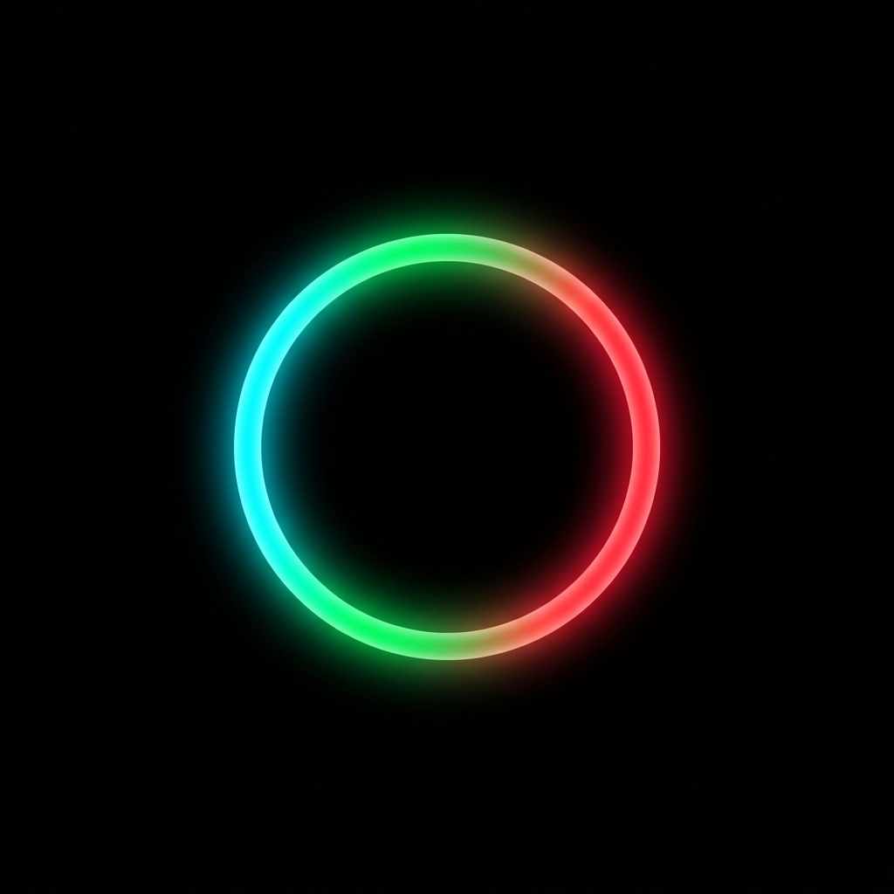

<div align="center">
  

  # Halo Environment Control

  *A sleek, frameless desktop utility that keeps your screens comfortable — dimming automatically when the content gets bright, with a quiet clock, floating over your wallpaper and out of the way.*
</div>

---

## What is Halo?

Halo is a personalized desktop utility built specifically for Windows. Unlike standard applications, Halo operates completely without traditional window frames or borders, floating seamlessly over your wallpaper. It is a focused control hub for two things: keeping screen brightness comfortable across every monitor, and displaying a minimalist clock.

## Key Features & How It Works

### Modular Interface
Drag the control hub anywhere on your screen. The two controls toggle independently.

- **Clock Widget** — A standalone, minimalist 24-hour clock that docks itself quietly on your screen. Move it left, center, or right.
- **Screen Dimmer** — Drops brightness across one or all of your monitors. It lowers hardware brightness where supported, and for anything darker than the panel allows it fades in a soft black overlay per display, so it dims every screen even when the monitor has no hardware brightness control.

### Auto-Dim *(v0.2)*
The problem Halo was built for: at night, with the monitors already dimmed, opening a white PDF or a light-background website is still blinding. Global brightness can't fix that — turning everything down far enough to tame a white page makes a dark interface unreadable.

Auto-dim solves it by reacting to what is actually on each screen. It is **active whenever Halo is running** — there is no mode to remember and nothing to switch on.

- **Per-display and independent.** A bright document on one monitor dims that monitor only; a dark editor on the other is left alone.
- **Scores glare, not average brightness.** It measures the *fraction of the screen that is genuinely bright*, which is what actually causes discomfort. Mean brightness is a poor signal here — on a real desktop, browser chrome, page margins and dark surroundings drag the average so low that a white document barely registers.
- **Additive, never subtractive.** Auto-dim can only darken *beyond* where you left the slider. It will never brighten your screens on its own.
- **Fast to dim, slow to recover.** Bright content is clamped almost immediately; the dimming eases off over several seconds. This is deliberate — it means scrolling past a dark patch doesn't flash the room bright, and it takes the edge off strobing video.
- **Cheap when nothing is happening.** Sampling backs off automatically while the screen is static and speeds up the moment something changes.

The **Strength** slider sets the ceiling — how dark auto-dim is allowed to go. Everything else is automatic.

### Crash-safe brightness
Brightness is written into the monitor itself over DDC/CI, which means the value survives a crash, a reboot, and even the sign-in screen. If an app dims your screens and then dies, nothing in Windows ever puts them back — you are simply left staring at dark panels with no obvious cause.

Halo takes that seriously:

- The pre-Halo brightness of every monitor is **saved to disk**, not just held in memory, so it survives an unexpected exit.
- On launch, Halo detects that a previous session ended without restoring and **preserves the original snapshot** rather than overwriting it with whatever dimmed value the monitors are currently showing.
- Recovery is **deliberately manual** — a **Restore Monitors** button in the dimmer panel. Automatically slamming the panels back to full brightness would be exactly the wrong behaviour at 4am.
- Only one instance can run at a time, so two copies can never fight over your hardware brightness.

## Installation

Download the official Portable Executable from the [Releases](https://github.com/therobwingfield/halo/releases) page.

1. Download the `halo 0.1.0.exe` file and move it to your desired permanent folder.
2. Double-click the file to launch the application.
3. **Auto-Start**: On first run Halo registers itself into the Windows Startup sequence and launches in the background every time you sign in.

> **Note:** Hardware brightness control relies on Python with the [`screen-brightness-control`](https://pypi.org/project/screen-brightness-control/) package available on the machine (`pip install screen-brightness-control`). Without it, the software-overlay dimming — including auto-dim — still works on every monitor.

## Development

Halo is built with **Electron**, **React**, and **Vite**.

```bash
# Install dependencies
npm install

# Run locally in development mode
npm run dev

# Compile the portable Windows executable
npm run build
```

The build output lands in `dist_installer/win-unpacked`. Deploy by copying that **entire folder** — `electron-builder` embeds asar-integrity hashes into `halo.exe`, so replacing `app.asar` alone will fail the integrity check.

> ⚠️ Never launch a new build while an older instance still holds the monitors dimmed. The new process would snapshot the *dimmed* value as your "pre-Halo" brightness. Close the running instance first.

### Tuning auto-dim

All of the behaviour lives in a single `AUTO` block at the top of `electron/main.cjs`:

| Setting | Meaning |
|---|---|
| `brightPixel` | Luminance above which a pixel counts as "glaring" |
| `knee` / `full` | Fraction of bright pixels where dimming starts / reaches maximum |
| `maxOpacity` | Ceiling for auto-dim (the Strength slider) |
| `attackPerSec` / `releasePerSec` | How fast dimming comes on and eases off, in opacity units per second |
| `activeMs` / `mediumMs` / `idleMs` | Adaptive sampling rates |

Two implementation notes worth preserving:

1. **Sampling and easing are intentionally decoupled.** The sampler only publishes a target; a separate fixed-interval animator eases toward it. Easing per sample instead produces visible pulsing, because the adaptive sampler changes its rate and a fixed per-tick step becomes a large discrete jump once it backs off.
2. **Overlays set content protection** so they are excluded from screen capture. Without it the sampler measures its own dimming, and the loop oscillates.

### Project layout

```
electron/
  main.cjs        Main process: windows, overlays, brightness, auto-dim
  preload.cjs     Context-isolated IPC bridge
  settings.cjs    Atomic JSON state store (brightness snapshot, preferences)
scripts/
  brightness.py   DDC/CI hardware brightness helper
src/
  App.tsx         Widget, clock, dimmer panel and controls
```

---

## Attribution & License

- **Concept, Design, & Architecture**: Rob Wingfield

Copyright (c) 2026 Rob Wingfield. All Rights Reserved.

*Built exclusively for Windows 11.*
